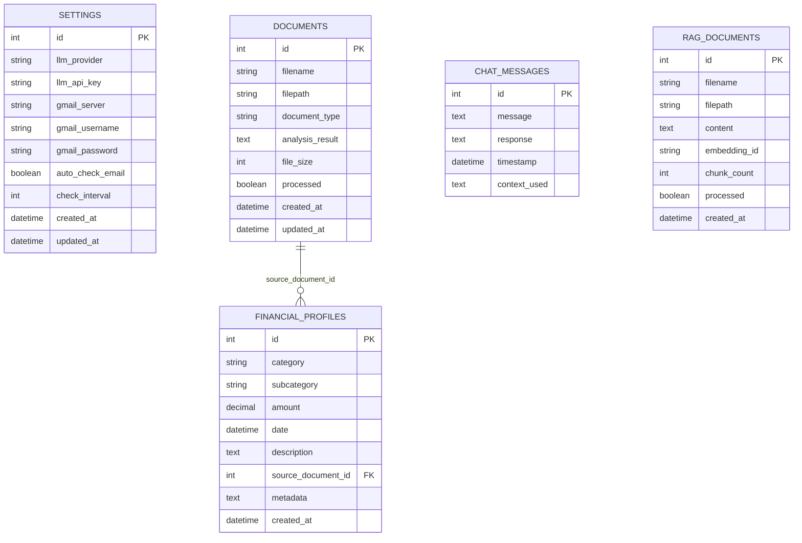

# Database Schema Documentation

Complete database schema reference for Personal Finance Agent's SQLite database.

## 🗄️ Database Overview

Personal Finance Agent uses **SQLite** for local data storage with the following characteristics:

- **Database File**: `%APPDATA%\Personal Finance Agent\data\finance_agent.db`
- **SQLite Version**: 3.x
- **ORM**: SQLAlchemy with Alembic for migrations
- **Encryption**: Database file encrypted at rest
- **Backup**: Automatic daily backups with configurable retention

## 📊 Entity Relationship Diagram



## 📋 Table Schemas

### Settings Table

Stores application configuration and user preferences.

```sql
CREATE TABLE settings (
    id INTEGER PRIMARY KEY AUTOINCREMENT,
    llm_provider VARCHAR(50) NOT NULL DEFAULT 'openai',
    llm_api_key TEXT,
    gmail_server VARCHAR(255),
    gmail_username VARCHAR(255),
    gmail_password TEXT,
    auto_check_email BOOLEAN NOT NULL DEFAULT FALSE,
    check_interval INTEGER NOT NULL DEFAULT 60,
    created_at DATETIME NOT NULL DEFAULT CURRENT_TIMESTAMP,
    updated_at DATETIME NOT NULL DEFAULT CURRENT_TIMESTAMP
);

-- Triggers for automatic timestamp updates
CREATE TRIGGER update_settings_timestamp 
    AFTER UPDATE ON settings
    FOR EACH ROW
    WHEN NEW.updated_at = OLD.updated_at
BEGIN
    UPDATE settings SET updated_at = CURRENT_TIMESTAMP WHERE id = NEW.id;
END;
```

**Field Descriptions**:
- `id`: Primary key, auto-increment
- `llm_provider`: AI provider ("openai", "anthropic")
- `llm_api_key`: Encrypted API key for LLM service
- `gmail_server`: IMAP server address for email integration
- `gmail_username`: Email account username
- `gmail_password`: Encrypted email password/app password
- `auto_check_email`: Enable automatic email checking
- `check_interval`: Email check frequency in minutes
- `created_at`: Record creation timestamp
- `updated_at`: Last modification timestamp

**Constraints**:
- Only one settings record allowed (enforced by application logic)
- `llm_provider` must be valid provider name
- `check_interval` must be between 1 and 1440 minutes

### Documents Table

Stores uploaded financial documents and their analysis results.

```sql
CREATE TABLE documents (
    id INTEGER PRIMARY KEY AUTOINCREMENT,
    filename VARCHAR(255) NOT NULL,
    filepath VARCHAR(500) NOT NULL UNIQUE,
    document_type VARCHAR(50) NOT NULL DEFAULT 'financial',
    analysis_result TEXT,
    file_size INTEGER NOT NULL,
    processed BOOLEAN NOT NULL DEFAULT FALSE,
    created_at DATETIME NOT NULL DEFAULT CURRENT_TIMESTAMP,
    updated_at DATETIME NOT NULL DEFAULT CURRENT_TIMESTAMP
);

-- Indexes for common queries
CREATE INDEX idx_documents_document_type ON documents(document_type);
CREATE INDEX idx_documents_processed ON documents(processed);
CREATE INDEX idx_documents_created_at ON documents(created_at DESC);

-- Trigger for automatic timestamp updates
CREATE TRIGGER update_documents_timestamp 
    AFTER UPDATE ON documents
    FOR EACH ROW
    WHEN NEW.updated_at = OLD.updated_at
BEGIN
    UPDATE documents SET updated_at = CURRENT_TIMESTAMP WHERE id = NEW.id;
END;
```

**Field Descriptions**:
- `id`: Primary key, auto-increment
- `filename`: Original filename of uploaded document
- `filepath`: Full path to stored document file
- `document_type`: Detected/assigned document type
- `analysis_result`: JSON string containing AI analysis results
- `file_size`: File size in bytes
- `processed`: Whether analysis is complete
- `created_at`: Upload timestamp
- `updated_at`: Last modification timestamp

**Document Types**:
- `financial`: General financial document
- `credit_card`: Credit card statement
- `bank_statement`: Bank account statement
- `investment`: Investment/brokerage statement
- `tax_document`: Tax form or return
- `insurance`: Insurance policy or statement
- `loan`: Loan or mortgage statement

**Analysis Result Structure**:
```json
{
  "document_type": "credit_card",
  "date_range": {
    "start_date": "2024-01-01",
    "end_date": "2024-01-31"
  },
  "account_info": {
    "account_number": "****1234",
    "institution": "Chase Bank",
    "account_type": "credit"
  },
  "transactions": [
    {
      "date": "2024-01-15",
      "description": "Amazon Purchase",
      "amount": -89.99,
      "category": "shopping",
      "type": "debit"
    }
  ],
  "summary": {
    "total_debits": -1234.56,
    "total_credits": 100.00,
    "net_change": -1134.56,
    "starting_balance": 500.00,
    "ending_balance": -634.56
  },
  "key_insights": [
    "Spending increased 15% compared to previous month",
    "Largest expense category: dining ($345.67)"
  ]
}
```

### Financial Profiles Table

Stores individual financial transactions and data points extracted from documents.

```sql
CREATE TABLE financial_profiles (
    id INTEGER PRIMARY KEY AUTOINCREMENT,
    category VARCHAR(100) NOT NULL,
    subcategory VARCHAR(100),
    amount DECIMAL(12, 2) NOT NULL,
    date DATETIME,
    description TEXT,
    source_document_id INTEGER,
    metadata TEXT,
    created_at DATETIME NOT NULL DEFAULT CURRENT_TIMESTAMP,
    
    FOREIGN KEY (source_document_id) REFERENCES documents(id) ON DELETE CASCADE
);

-- Indexes for financial analysis queries
CREATE INDEX idx_financial_profiles_category ON financial_profiles(category);
CREATE INDEX idx_financial_profiles_date ON financial_profiles(date DESC);
CREATE INDEX idx_financial_profiles_amount ON financial_profiles(amount);
CREATE INDEX idx_financial_profiles_source_document ON financial_profiles(source_document_id);

-- Composite index for common filtered queries
CREATE INDEX idx_financial_profiles_category_date ON financial_profiles(category, date DESC);
```

**Field Descriptions**:
- `id`: Primary key, auto-increment
- `category`: Main category (income, expenses, assets, liabilities, etc.)
- `subcategory`: Detailed subcategory (dining, gas, investments, etc.)
- `amount`: Transaction amount (negative for expenses, positive for income)
- `date`: Transaction or statement date
- `description`: Transaction description or memo
- `source_document_id`: Reference to source document
- `metadata`: Additional JSON metadata
- `created_at`: Record creation timestamp

**Category Hierarchy**:
```
income/
├── salary
├── bonus
├── investment_income
├── interest
└── other

expenses/
├── housing
├── food
├── transportation
├── entertainment
├── utilities
├── healthcare
└── other

assets/
├── cash
├── investments
├── real_estate
├── vehicles
└── other

liabilities/
├── credit_cards
├── loans
├── mortgages
└── other

investments/
├── stocks
├── bonds
├── mutual_funds
├── etfs
├── crypto
└── other
```

**Metadata Structure**:
```json
{
  "transaction_type": "debit",
  "original_category": "dining",
  "merchant": "Restaurant ABC",
  "location": "New York, NY",
  "confidence_score": 0.95,
  "manual_override": false,
  "tags": ["business_expense", "client_dinner"]
}
```

### Chat Messages Table

Stores conversation history with the AI assistant.

```sql
CREATE TABLE chat_messages (
    id INTEGER PRIMARY KEY AUTOINCREMENT,
    message TEXT NOT NULL,
    response TEXT NOT NULL,
    timestamp DATETIME NOT NULL DEFAULT CURRENT_TIMESTAMP,
    context_used TEXT
);

-- Index for retrieving recent conversations
CREATE INDEX idx_chat_messages_timestamp ON chat_messages(timestamp DESC);
```

**Field Descriptions**:
- `id`: Primary key, auto-increment
- `message`: User's input message
- `response`: AI assistant's response
- `timestamp`: Conversation timestamp
- `context_used`: JSON string of financial context used for response

**Context Structure**:
```json
{
  "net_worth": 35000.00,
  "monthly_income": 5000.00,
  "monthly_expenses": 3500.00,
  "recent_transactions": [
    {
      "date": "2024-01-15",
      "description": "Grocery Store",
      "amount": -85.50,
      "category": "food"
    }
  ],
  "investment_portfolio": {
    "AAPL": 5000.00,
    "MSFT": 3000.00
  }
}
```

### RAG Documents Table

Stores reference documents for Retrieval-Augmented Generation (planned feature).

```sql
CREATE TABLE rag_documents (
    id INTEGER PRIMARY KEY AUTOINCREMENT,
    filename VARCHAR(255) NOT NULL,
    filepath VARCHAR(500) NOT NULL UNIQUE,
    content TEXT,
    embedding_id VARCHAR(100),
    chunk_count INTEGER NOT NULL DEFAULT 0,
    processed BOOLEAN NOT NULL DEFAULT FALSE,
    created_at DATETIME NOT NULL DEFAULT CURRENT_TIMESTAMP
);

-- Indexes for RAG operations
CREATE INDEX idx_rag_documents_processed ON rag_documents(processed);
CREATE INDEX idx_rag_documents_embedding_id ON rag_documents(embedding_id);
CREATE INDEX idx_rag_documents_created_at ON rag_documents(created_at DESC);
```

**Field Descriptions**:
- `id`: Primary key, auto-increment
- `filename`: Original filename of uploaded document
- `filepath`: Full path to stored document file
- `content`: Extracted text content
- `embedding_id`: Reference to vector database embeddings
- `chunk_count`: Number of text chunks created
- `processed`: Whether document has been processed for RAG
- `created_at`: Upload timestamp

## 🔍 Common Queries

### Financial Analysis Queries

#### Monthly Spending by Category
```sql
SELECT 
    category,
    subcategory,
    SUM(ABS(amount)) as total_spent,
    COUNT(*) as transaction_count,
    AVG(ABS(amount)) as avg_transaction
FROM financial_profiles 
WHERE 
    category = 'expenses' 
    AND date >= date('now', '-1 month')
    AND amount < 0
GROUP BY category, subcategory
ORDER BY total_spent DESC;
```

#### Net Worth Calculation
```sql
SELECT 
    SUM(CASE WHEN category IN ('assets', 'income') THEN amount ELSE 0 END) as total_assets,
    SUM(CASE WHEN category IN ('liabilities', 'expenses') AND amount < 0 THEN ABS(amount) ELSE 0 END) as total_liabilities,
    SUM(CASE WHEN category IN ('assets', 'income') THEN amount ELSE 0 END) - 
    SUM(CASE WHEN category IN ('liabilities', 'expenses') AND amount < 0 THEN ABS(amount) ELSE 0 END) as net_worth
FROM financial_profiles;
```

#### Investment Portfolio Summary
```sql
SELECT 
    JSON_EXTRACT(metadata, '$.symbol') as symbol,
    SUM(amount) as total_value,
    COUNT(*) as positions,
    MAX(date) as last_updated
FROM financial_profiles 
WHERE 
    category = 'investments' 
    AND JSON_EXTRACT(metadata, '$.symbol') IS NOT NULL
GROUP BY JSON_EXTRACT(metadata, '$.symbol')
ORDER BY total_value DESC;
```

### Document Management Queries

#### Documents by Processing Status
```sql
SELECT 
    document_type,
    processed,
    COUNT(*) as document_count,
    SUM(file_size) as total_size
FROM documents 
GROUP BY document_type, processed
ORDER BY document_type, processed;
```

#### Recent Document Activity
```sql
SELECT 
    d.id,
    d.filename,
    d.document_type,
    d.processed,
    COUNT(fp.id) as transaction_count,
    d.created_at
FROM documents d
LEFT JOIN financial_profiles fp ON d.id = fp.source_document_id
WHERE d.created_at >= date('now', '-7 days')
GROUP BY d.id, d.filename, d.document_type, d.processed, d.created_at
ORDER BY d.created_at DESC;
```

### Chat Analytics Queries

#### Most Common Question Topics
```sql
SELECT 
    CASE 
        WHEN LOWER(message) LIKE '%net worth%' THEN 'net_worth'
        WHEN LOWER(message) LIKE '%spending%' OR LOWER(message) LIKE '%expenses%' THEN 'spending'
        WHEN LOWER(message) LIKE '%investment%' OR LOWER(message) LIKE '%portfolio%' THEN 'investments'
        WHEN LOWER(message) LIKE '%income%' OR LOWER(message) LIKE '%salary%' THEN 'income'
        ELSE 'other'
    END as topic,
    COUNT(*) as question_count,
    AVG(LENGTH(response)) as avg_response_length
FROM chat_messages
WHERE timestamp >= date('now', '-30 days')
GROUP BY topic
ORDER BY question_count DESC;
```

## 🔄 Database Migrations

### Migration Files Location
```
data/migrations/
├── 001_initial_schema.sql
├── 002_add_rag_documents.sql
├── 003_add_indexes.sql
└── 004_add_metadata_fields.sql
```

### Migration Script Example
```sql
-- Migration: 002_add_rag_documents.sql
-- Description: Add RAG documents table for future feature

-- Create RAG documents table
CREATE TABLE rag_documents (
    id INTEGER PRIMARY KEY AUTOINCREMENT,
    filename VARCHAR(255) NOT NULL,
    filepath VARCHAR(500) NOT NULL UNIQUE,
    content TEXT,
    embedding_id VARCHAR(100),
    chunk_count INTEGER NOT NULL DEFAULT 0,
    processed BOOLEAN NOT NULL DEFAULT FALSE,
    created_at DATETIME NOT NULL DEFAULT CURRENT_TIMESTAMP
);

-- Add indexes
CREATE INDEX idx_rag_documents_processed ON rag_documents(processed);
CREATE INDEX idx_rag_documents_embedding_id ON rag_documents(embedding_id);
CREATE INDEX idx_rag_documents_created_at ON rag_documents(created_at DESC);

-- Update schema version
INSERT INTO schema_versions (version, applied_at) VALUES (2, CURRENT_TIMESTAMP);
```

### Running Migrations
```python
# In Python code
from alembic import command
from alembic.config import Config

def run_migrations():
    alembic_cfg = Config("alembic.ini")
    command.upgrade(alembic_cfg, "head")
```

## 🔐 Security Considerations

### Data Encryption
- **API Keys**: Encrypted using Windows DPAPI before storage
- **Passwords**: Encrypted email passwords using DPAPI
- **Database**: SQLite file encrypted at rest (planned)
- **Backups**: Backup files encrypted with same key

### Access Control
- **File Permissions**: Database file restricted to current user
- **Connection Limits**: SQLite connection pool limits
- **Query Timeout**: Prevent long-running queries
- **SQL Injection**: Parameterized queries only

### Privacy Protection
- **PII Filtering**: Sensitive data filtered before AI processing
- **Data Retention**: Configurable retention policies
- **Audit Trail**: No logging of sensitive financial data
- **Local Only**: No external database connections

## 📊 Performance Optimization

### Indexing Strategy
```sql
-- Primary indexes for common queries
CREATE INDEX idx_financial_profiles_category_date ON financial_profiles(category, date DESC);
CREATE INDEX idx_financial_profiles_amount_range ON financial_profiles(amount) WHERE amount != 0;
CREATE INDEX idx_documents_type_processed ON documents(document_type, processed);

-- Covering indexes for dashboard queries
CREATE INDEX idx_financial_summary_covering ON financial_profiles(category, amount, date) 
WHERE category IN ('assets', 'liabilities', 'income', 'expenses');
```

### Query Optimization
```sql
-- Use EXPLAIN QUERY PLAN to analyze performance
EXPLAIN QUERY PLAN 
SELECT category, SUM(amount) 
FROM financial_profiles 
WHERE date >= '2024-01-01' 
GROUP BY category;

-- Optimize with proper indexing and WHERE clauses
```

### Maintenance Operations
```sql
-- Regular maintenance commands
VACUUM;                          -- Rebuild database file
REINDEX;                        -- Rebuild all indexes
ANALYZE;                        -- Update query planner statistics
PRAGMA integrity_check;         -- Check database integrity
PRAGMA foreign_key_check;      -- Check foreign key constraints
```

## 🗂️ Backup and Recovery

### Backup Strategy
```python
import sqlite3
import shutil
from datetime import datetime

def backup_database():
    """Create encrypted backup of database."""
    source_db = "data/finance_agent.db"
    backup_name = f"backup_{datetime.now().strftime('%Y%m%d_%H%M%S')}.db"
    backup_path = f"data/backups/{backup_name}"
    
    # Create backup using SQLite backup API
    source = sqlite3.connect(source_db)
    backup = sqlite3.connect(backup_path)
    source.backup(backup)
    
    source.close()
    backup.close()
    
    return backup_path
```

### Recovery Procedures
```python
def restore_database(backup_path: str):
    """Restore database from backup."""
    # Validate backup integrity
    conn = sqlite3.connect(backup_path)
    conn.execute("PRAGMA integrity_check")
    
    # Stop application
    # Replace current database
    shutil.copy2(backup_path, "data/finance_agent.db")
    
    # Restart application
    conn.close()
```

---

**Database Tools**: Use [DB Browser for SQLite](https://sqlitebrowser.org/) to visually explore the database schema and data during development.