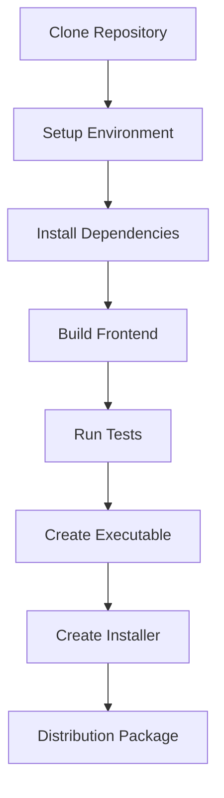

# Building from Source

Complete guide to building Personal Finance Agent from source code for development and distribution.

## 🎯 Prerequisites

### System Requirements
- **Windows 10/11** (64-bit) for final executable build
- **Python 3.9+** with pip
- **Node.js 18+** with npm
- **Git** for source control
- **Visual Studio Build Tools** (for some Python packages)

### Development Tools
- **PyInstaller** for executable creation
- **Inno Setup** for Windows installer (optional)
- **Code editor** (VS Code recommended)

## 🏗️ Build Process Overview



## 📦 Quick Build

For users who want to build quickly:

```bash
# Clone and build
git clone https://github.com/yourusername/personal-finance-agent.git
cd personal-finance-agent
python installer/build_installer.py
```

This script handles the entire build process automatically.

## 🔧 Detailed Build Steps

### Step 1: Environment Setup

#### Clone Repository
```bash
git clone https://github.com/yourusername/personal-finance-agent.git
cd personal-finance-agent

# Verify repository structure
ls -la
```

#### Create Virtual Environment
```bash
# Create and activate virtual environment
python -m venv venv

# Windows
venv\Scripts\activate

# Linux/Mac (for development)
source venv/bin/activate

# Verify activation
where python
```

#### Install Python Dependencies
```bash
# Upgrade pip first
python -m pip install --upgrade pip

# Install all dependencies
pip install -r requirements.txt

# Verify critical packages
pip show fastapi pystray PyMuPDF
```

### Step 2: Frontend Build

#### Install Node Dependencies
```bash
cd src/ui/frontend

# Install dependencies
npm install

# Verify installation
npm list --depth=0
```

#### Build Frontend
```bash
# Development build
npm run dev        # For development with hot reload

# Production build
npm run build      # Creates optimized build in build/

# Verify build
ls -la build/
```

#### Frontend Build Configuration
The build is configured in `vite.config.ts`:
```typescript
export default defineConfig({
  plugins: [react()],
  build: {
    outDir: 'build',
    sourcemap: true,
    rollupOptions: {
      output: {
        manualChunks: {
          vendor: ['react', 'react-dom'],
          mui: ['@mui/material', '@mui/icons-material']
        }
      }
    }
  }
})
```

### Step 3: Backend Preparation

#### Initialize Database
```bash
# Return to project root
cd ../../..

# Initialize database schema
python -c "from src.ui.backend.database import init_db; init_db()"

# Verify database creation
ls data/finance_agent.db
```

#### Test Backend
```bash
# Run backend server (test only)
uvicorn src.ui.backend.main:app --host 127.0.0.1 --port 8000

# In another terminal, test API
curl http://localhost:8000/health
```

### Step 4: Testing

#### Run Python Tests
```bash
# Install test dependencies (if not in requirements.txt)
pip install pytest pytest-asyncio pytest-cov httpx

# Run all tests
pytest

# Run with coverage
pytest --cov=src --cov-report=html

# Run specific test categories
pytest tests/unit/
pytest tests/integration/
```

#### Run Frontend Tests
```bash
cd src/ui/frontend

# Run tests
npm test

# Run with coverage
npm run test:coverage
```

#### Code Quality Checks
```bash
# Python linting and formatting
flake8 src/
black --check src/
mypy src/

# Frontend linting
cd src/ui/frontend
npm run lint
```

### Step 5: Create Executable

#### PyInstaller Configuration

Create `PersonalFinanceAgent.spec`:
```python
# -*- mode: python ; coding: utf-8 -*-

block_cipher = None

a = Analysis(
    ['src/tray/tray_app.py'],
    pathex=[],
    binaries=[],
    datas=[
        ('src/ui/frontend/build', 'src/ui/frontend/build'),
        ('data', 'data'),
        ('config', 'config'),
    ],
    hiddenimports=[
        'uvicorn',
        'uvicorn.lifespan',
        'uvicorn.lifespan.on',
        'uvicorn.loops',
        'uvicorn.loops.auto',
        'uvicorn.protocols',
        'uvicorn.protocols.http',
        'uvicorn.protocols.http.auto',
        'uvicorn.protocols.websockets',
        'uvicorn.protocols.websockets.auto',
        'pystray._win32',
        'PIL._tkinter_finder',
        'sqlalchemy.sql.default_comparator',
        'anthropic',
        'openai',
        'chromadb',
        'sentence_transformers',
    ],
    hookspath=[],
    hooksconfig={},
    runtime_hooks=[],
    excludes=[],
    win_no_prefer_redirects=False,
    win_private_assemblies=False,
    cipher=block_cipher,
    noarchive=False,
)

pyz = PYZ(a.pure, a.zipped_data, cipher=block_cipher)

exe = EXE(
    pyz,
    a.scripts,
    [],
    exclude_binaries=True,
    name='PersonalFinanceAgent',
    debug=False,
    bootloader_ignore_signals=False,
    strip=False,
    upx=True,
    console=False,
    disable_windowed_traceback=False,
    argv_emulation=False,
    target_arch=None,
    cofile=None,
    icon='installer/icon.ico',
)

coll = COLLECT(
    exe,
    a.binaries,
    a.zipfiles,
    a.datas,
    strip=False,
    upx=True,
    upx_exclude=[],
    name='PersonalFinanceAgent',
)
```

#### Build Executable
```bash
# Generate spec file (if not created manually)
pyi-makespec --onedir --windowed --icon=installer/icon.ico src/tray/tray_app.py

# Build executable
pyinstaller PersonalFinanceAgent.spec --clean

# Test executable
dist/PersonalFinanceAgent/PersonalFinanceAgent.exe
```

#### Troubleshoot Build Issues

**Missing Modules**:
```bash
# Add to hiddenimports in spec file
'missing.module.name'

# Or use --hidden-import flag
pyinstaller --hidden-import=missing.module PersonalFinanceAgent.spec
```

**Large Executable Size**:
```bash
# Exclude unnecessary modules
excludes=['tkinter', 'matplotlib', 'scipy']

# Use UPX compression (already enabled in spec)
upx=True
```

**Runtime Errors**:
```bash
# Enable debug mode temporarily
debug=True

# Check for missing data files
datas=[('path/to/data', 'data')]
```

## 📦 Creating Windows Installer

### Inno Setup Configuration

Create `installer/PersonalFinanceAgent.iss`:
```ini
[Setup]
AppName=Personal Finance Agent
AppVersion=1.0.0
AppPublisher=Personal Finance Agent
AppPublisherURL=https://github.com/yourusername/personal-finance-agent
AppSupportURL=https://github.com/yourusername/personal-finance-agent/issues
AppUpdatesURL=https://github.com/yourusername/personal-finance-agent/releases
DefaultDirName={autopf}\Personal Finance Agent
DefaultGroupName=Personal Finance Agent
AllowNoIcons=yes
LicenseFile=LICENSE
OutputDir=installer\output
OutputBaseFilename=PersonalFinanceAgent-Setup-1.0.0
SetupIconFile=installer\icon.ico
Compression=lzma
SolidCompression=yes
WizardStyle=modern
PrivilegesRequired=lowest
ArchitecturesAllowed=x64
ArchitecturesInstallIn64BitMode=x64

[Languages]
Name: "english"; MessagesFile: "compiler:Default.isl"

[Tasks]
Name: "desktopicon"; Description: "{cm:CreateDesktopIcon}"; GroupDescription: "{cm:AdditionalIcons}"; Flags: unchecked
Name: "quicklaunchicon"; Description: "{cm:CreateQuickLaunchIcon}"; GroupDescription: "{cm:AdditionalIcons}"; Flags: unchecked; OnlyBelowVersion: 6.1
Name: "startupicon"; Description: "Start automatically with Windows"; GroupDescription: "Startup Options"; Flags: unchecked

[Files]
Source: "dist\PersonalFinanceAgent\*"; DestDir: "{app}"; Flags: ignoreversion recursesubdirs createallsubdirs

[Icons]
Name: "{group}\Personal Finance Agent"; Filename: "{app}\PersonalFinanceAgent.exe"
Name: "{group}\{cm:UninstallProgram,Personal Finance Agent}"; Filename: "{uninstallexe}"
Name: "{autodesktop}\Personal Finance Agent"; Filename: "{app}\PersonalFinanceAgent.exe"; Tasks: desktopicon
Name: "{userappdata}\Microsoft\Internet Explorer\Quick Launch\Personal Finance Agent"; Filename: "{app}\PersonalFinanceAgent.exe"; Tasks: quicklaunchicon

[Registry]
Root: HKCU; Subkey: "Software\Microsoft\Windows\CurrentVersion\Run"; ValueType: string; ValueName: "PersonalFinanceAgent"; ValueData: "{app}\PersonalFinanceAgent.exe"; Flags: uninsdeletevalue; Tasks: startupicon

[Run]
Filename: "{app}\PersonalFinanceAgent.exe"; Description: "{cm:LaunchProgram,Personal Finance Agent}"; Flags: nowait postinstall skipifsilent

[Code]
procedure CurStepChanged(CurStep: TSetupStep);
begin
  if CurStep = ssPostInstall then
  begin
    CreateDir(ExpandConstant('{userappdata}\Personal Finance Agent'));
    CreateDir(ExpandConstant('{userappdata}\Personal Finance Agent\data'));
    CreateDir(ExpandConstant('{userappdata}\Personal Finance Agent\config'));
  end;
end;
```

### Build Installer
```bash
# Install Inno Setup from https://jrsoftware.org/isinfo.php

# Compile installer
"C:\Program Files (x86)\Inno Setup 6\ISCC.exe" installer\PersonalFinanceAgent.iss

# Or use command line
iscc installer\PersonalFinanceAgent.iss

# Output will be in installer\output\
```

## 🤖 Automated Build Script

### Build Script (`installer/build_installer.py`)

```python
#!/usr/bin/env python3
"""
Complete build script for Personal Finance Agent
"""

import os
import sys
import shutil
import subprocess
from pathlib import Path

def run_command(cmd, cwd=None):
    """Run command and return success status."""
    print(f"Running: {cmd}")
    try:
        result = subprocess.run(cmd, shell=True, check=True, cwd=cwd, 
                              capture_output=True, text=True)
        print(result.stdout)
        return True
    except subprocess.CalledProcessError as e:
        print(f"Error: {e}")
        print(f"Stdout: {e.stdout}")
        print(f"Stderr: {e.stderr}")
        return False

def build_frontend():
    """Build React frontend."""
    print("Building React frontend...")
    frontend_dir = Path("src/ui/frontend")
    
    if not frontend_dir.exists():
        print("Frontend directory not found!")
        return False
    
    # Install dependencies and build
    if not run_command("npm install", cwd=frontend_dir):
        return False
    
    if not run_command("npm run build", cwd=frontend_dir):
        return False
    
    return True

def create_executable():
    """Build executable with PyInstaller."""
    print("Building executable...")
    
    # Create spec file if it doesn't exist
    if not Path("PersonalFinanceAgent.spec").exists():
        if not create_pyinstaller_spec():
            return False
    
    # Build executable
    if not run_command("pyinstaller PersonalFinanceAgent.spec --clean"):
        return False
    
    return True

def create_installer():
    """Create Windows installer."""
    print("Creating Windows installer...")
    
    if not Path("installer/PersonalFinanceAgent.iss").exists():
        if not create_inno_setup_script():
            return False
    
    # Try to find Inno Setup
    inno_paths = [
        "C:\\Program Files (x86)\\Inno Setup 6\\ISCC.exe",
        "C:\\Program Files\\Inno Setup 6\\ISCC.exe",
        "iscc"  # If in PATH
    ]
    
    for inno_path in inno_paths:
        if run_command(f'"{inno_path}" installer\\PersonalFinanceAgent.iss'):
            return True
    
    print("Inno Setup not found. Install from https://jrsoftware.org/isinfo.php")
    return False

def main():
    """Main build process."""
    print("Starting Personal Finance Agent build process...")
    
    steps = [
        ("Building frontend", build_frontend),
        ("Creating executable", create_executable),
        ("Creating installer", create_installer),
    ]
    
    for step_name, step_func in steps:
        print(f"\n=== {step_name} ===")
        if not step_func():
            print(f"Failed at step: {step_name}")
            return False
        print(f"✓ {step_name} completed successfully")
    
    print("\n=== Build completed successfully! ===")
    print("Installer created in: installer/output/")
    return True

if __name__ == "__main__":
    success = main()
    sys.exit(0 if success else 1)
```

### Run Automated Build
```bash
# Run complete build process
python installer/build_installer.py

# Build specific components
python installer/build_installer.py --frontend-only
python installer/build_installer.py --executable-only
```

## 📋 Build Verification

### Test Executable
```bash
# Test in clean environment
dist/PersonalFinanceAgent/PersonalFinanceAgent.exe

# Check dependencies
objdump -p dist/PersonalFinanceAgent/PersonalFinanceAgent.exe | grep "DLL Name"
```

### Test Installer
```bash
# Install in test environment
installer/output/PersonalFinanceAgent-Setup-1.0.0.exe /SILENT

# Verify installation
"C:\Program Files\Personal Finance Agent\PersonalFinanceAgent.exe"

# Check registry entries
reg query "HKCU\Software\Microsoft\Windows\CurrentVersion\Run" /v PersonalFinanceAgent
```

### Verify File Integrity
```bash
# Check file sizes
ls -lh dist/PersonalFinanceAgent/
ls -lh installer/output/

# Verify all required files present
dir dist\PersonalFinanceAgent\
dir "C:\Program Files\Personal Finance Agent\"
```

## 🐛 Common Build Issues

### Python Build Issues

#### Missing Dependencies
```bash
# Error: ModuleNotFoundError during runtime
# Solution: Add to hiddenimports in spec file
hiddenimports=['missing_module']

# Or install missing package
pip install missing-package
```

#### Path Issues
```bash
# Error: FileNotFoundError for data files
# Solution: Add to datas in spec file
datas=[('src/ui/frontend/build', 'src/ui/frontend/build')]
```

#### Size Issues
```bash
# Large executable size
# Solution: Exclude unnecessary packages
excludes=['tkinter', 'matplotlib', 'scipy']

# Enable UPX compression
upx=True
```

### Frontend Build Issues

#### Node Version Issues
```bash
# Error: Node version incompatibility
# Solution: Use Node Version Manager
nvm install 18.18.0
nvm use 18.18.0
```

#### Memory Issues
```bash
# Error: JavaScript heap out of memory
# Solution: Increase Node memory limit
set NODE_OPTIONS=--max_old_space_size=4096
npm run build
```

#### TypeScript Errors
```bash
# Error: TypeScript compilation errors
# Solution: Fix type issues or skip type checking
npm run build --skipLibCheck
```

### Installer Issues

#### Inno Setup Not Found
```bash
# Download and install from https://jrsoftware.org/isinfo.php
# Or use portable version
```

#### Permission Issues
```bash
# Run as administrator if needed
# Or change PrivilegesRequired=lowest in .iss file
```

#### Registry Issues
```bash
# Test registry entries manually
reg add "HKCU\Software\Microsoft\Windows\CurrentVersion\Run" /v "PersonalFinanceAgent" /t REG_SZ /d "C:\Program Files\Personal Finance Agent\PersonalFinanceAgent.exe"
```

## 📊 Build Optimization

### Performance Optimization

#### Executable Size
```python
# In spec file
excludes=[
    'tkinter',          # GUI toolkit (not used)
    'matplotlib',       # Plotting (not used)
    'scipy',           # Scientific computing (not used)
    'pandas.plotting',  # Pandas plotting (not used)
    'IPython',         # Interactive Python (not used)
]
```

#### Build Speed
```bash
# Use parallel builds
export PYTHONOPTIMIZE=1

# Use build cache
pyinstaller --clean=false PersonalFinanceAgent.spec
```

#### Runtime Performance
```python
# In spec file
optimize_imports=True
strip=True              # Remove debug symbols
upx=True               # Compress executable
```

### CI/CD Integration

#### GitHub Actions Example
```yaml
name: Build Windows Executable

on:
  push:
    tags: ['v*']

jobs:
  build:
    runs-on: windows-latest
    
    steps:
    - uses: actions/checkout@v3
    
    - name: Set up Python
      uses: actions/setup-python@v3
      with:
        python-version: '3.9'
    
    - name: Set up Node.js
      uses: actions/setup-node@v3
      with:
        node-version: '18'
    
    - name: Build application
      run: python installer/build_installer.py
    
    - name: Upload artifacts
      uses: actions/upload-artifact@v3
      with:
        name: PersonalFinanceAgent-Windows
        path: installer/output/
```

---

**Next Steps**: After building, see [Deployment Guide](deployment.md) for distribution and installation instructions, or [Testing Guide](../developer/testing.md) for comprehensive testing procedures.