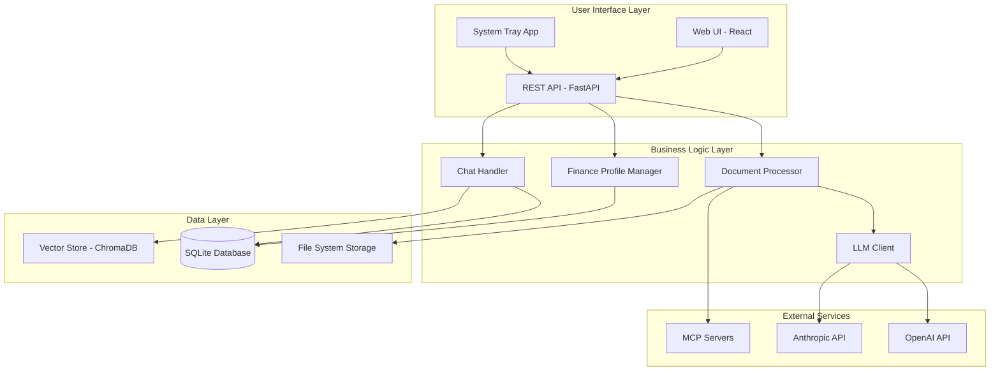
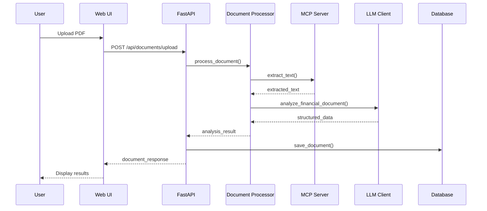
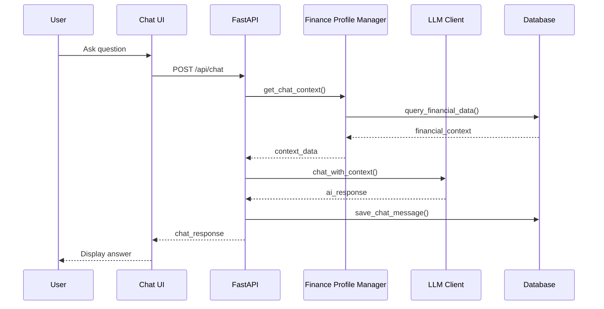
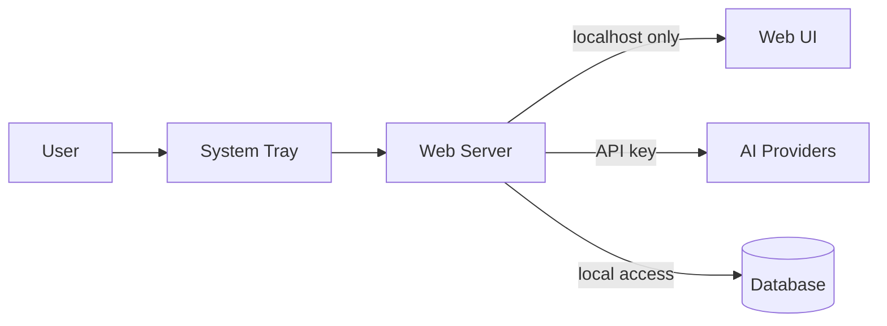

# Architecture Overview

Comprehensive overview of Personal Finance Agent's system architecture, design patterns, and component relationships.

## 🏗️ High-Level Architecture



## 🔧 Component Architecture

### System Tray Application (`src/tray/`)

**Purpose**: Windows desktop integration and application lifecycle management

**Key Components**:
- `tray_app.py`: Main entry point and system tray handler
- Menu management and user interaction
- Backend server lifecycle management
- Browser integration for web UI

**Design Patterns**:
- **Singleton**: Single tray instance per application
- **Observer**: Menu event handling
- **Command**: Menu action delegation

**Dependencies**:
- `pystray`: System tray integration
- `PIL`: Icon generation
- `uvicorn`: Backend server management
- `webbrowser`: Browser launching

### Web Backend (`src/ui/backend/`)

**Purpose**: REST API server and business logic coordination

**Key Components**:
```python
src/ui/backend/
├── main.py              # FastAPI application and routes
├── database.py          # Database connection and session management
├── models.py            # SQLAlchemy ORM models
├── schemas.py           # Pydantic data validation schemas
└── dependencies.py      # Dependency injection utilities
```

**API Endpoints**:
- `/health` - Health check
- `/api/settings` - Configuration management
- `/api/documents` - Document upload and management
- `/api/profile` - Financial profile data
- `/api/chat` - Chat interface
- `/api/rag` - RAG document management (planned)

**Design Patterns**:
- **Repository**: Data access abstraction
- **Dependency Injection**: FastAPI's dependency system
- **DTO**: Pydantic schemas for data transfer
- **Factory**: Database session creation

### Web Frontend (`src/ui/frontend/`)

**Purpose**: Modern React-based user interface

**Architecture**:
```typescript
src/ui/frontend/src/
├── components/          # Reusable UI components
│   └── Sidebar.tsx     # Navigation sidebar
├── pages/              # Page-level components
│   ├── Dashboard.tsx   # Financial overview
│   ├── Settings.tsx    # Configuration
│   ├── Documents.tsx   # Document management
│   ├── Chat.tsx        # AI chat interface
│   └── RAGDocuments.tsx # RAG management
├── services/           # API communication
│   └── api.ts          # Axios-based API client
├── types/              # TypeScript interfaces
│   └── index.ts        # Shared type definitions
└── utils/              # Utility functions
```

**Design Patterns**:
- **Component-Based Architecture**: React functional components
- **Hooks Pattern**: React hooks for state management
- **Service Layer**: Separate API communication layer
- **Type Safety**: TypeScript for compile-time safety

**State Management**:
- **Local State**: React useState for component state
- **API State**: React Query pattern for server state
- **Form State**: Controlled components for form handling

### Core Business Logic (`src/core/`)

#### Document Processor (`document_processor.py`)

**Purpose**: PDF processing and financial data extraction

**Architecture**:
```python
class DocumentProcessor:
    async def process_document() -> Dict[str, Any]
    async def _extract_text_via_mcp() -> str
    async def _extract_text_direct() -> str
    def _classify_document_type() -> str
    def get_document_insights() -> List[str]
```

**Processing Pipeline**:
1. **Text Extraction**: MCP server → Direct library fallback
2. **Document Classification**: Rule-based type detection
3. **AI Analysis**: LLM-powered data extraction
4. **Data Structuring**: Convert to standardized format
5. **Insight Generation**: Generate human-readable insights

**Design Patterns**:
- **Strategy**: Multiple text extraction strategies
- **Template Method**: Consistent processing pipeline
- **Factory**: Document type-specific processors

#### LLM Client (`llm_client.py`)

**Purpose**: AI provider integration and prompt management

**Architecture**:
```python
class LLMClient:
    def __init__(provider: str, api_key: str)
    async def analyze_financial_document() -> Dict[str, Any]
    async def chat_with_context() -> str
    def _get_financial_analysis_prompt() -> str
    def _format_financial_context() -> str
```

**Provider Support**:
- **OpenAI**: GPT-4 integration
- **Anthropic**: Claude-3-Sonnet integration
- **Extensible**: Plugin architecture for additional providers

**Design Patterns**:
- **Adapter**: Unified interface for different AI providers
- **Template Method**: Consistent prompt structure
- **Strategy**: Provider-specific implementations

#### Finance Profile Manager (`finance_profile.py`)

**Purpose**: Financial data aggregation and analysis

**Architecture**:
```python
class FinanceProfileManager:
    def add_financial_entry() -> FinancialProfile
    def process_document_analysis() -> None
    def get_profile_summary() -> Dict[str, Any]
    def get_chat_context() -> Dict[str, Any]
    def get_spending_trends() -> Dict[str, Any]
```

**Data Flow**:
1. **Document Analysis** → **Transaction Extraction**
2. **Transaction Categorization** → **Profile Updates**
3. **Aggregation** → **Summary Generation**
4. **Context Preparation** → **Chat Integration**

### MCP Integration (`src/mcp/`)

**Purpose**: Model Context Protocol server implementations

#### PDF Server (`pdf_server.py`)

**Capabilities**:
- Text extraction (PyMuPDF + pdfplumber)
- Table extraction
- Document structure analysis
- Metadata extraction

**MCP Tools**:
- `extract_text`: Multi-method text extraction
- `extract_tables`: Table data extraction
- `analyze_document_structure`: Document analysis

#### Stock Server (`stock_server.py`)

**Capabilities**:
- Stock quote retrieval
- Market summary data
- Portfolio valuation
- Demo data generation

**MCP Tools**:
- `get_stock_quote`: Individual stock data
- `get_market_summary`: Market indices
- `calculate_portfolio_value`: Portfolio analysis

### RAG System (`src/rag/`)

**Purpose**: Retrieval-Augmented Generation for enhanced AI responses

#### Vector Store (`vector_store.py`)

**Architecture**:
```python
class RAGVectorStore:
    def add_document() -> List[str]
    def search() -> List[Dict[str, Any]]
    def delete_document() -> bool
    def get_context_for_query() -> str
```

**Technology Stack**:
- **ChromaDB**: Vector database for embeddings
- **SentenceTransformers**: Text embedding generation
- **Semantic Search**: Query-document similarity matching

**Data Flow**:
1. **Document Upload** → **Text Chunking**
2. **Embedding Generation** → **Vector Storage**
3. **Query Processing** → **Similarity Search**
4. **Context Retrieval** → **AI Enhancement**

## 🗄️ Data Architecture

### Database Schema

```sql
-- Settings table
CREATE TABLE settings (
    id INTEGER PRIMARY KEY,
    llm_provider VARCHAR(50),
    llm_api_key TEXT,
    gmail_server VARCHAR(255),
    gmail_username VARCHAR(255),
    gmail_password TEXT,
    auto_check_email BOOLEAN,
    check_interval INTEGER,
    created_at DATETIME,
    updated_at DATETIME
);

-- Documents table
CREATE TABLE documents (
    id INTEGER PRIMARY KEY,
    filename VARCHAR(255),
    filepath VARCHAR(500),
    document_type VARCHAR(50),
    analysis_result TEXT,
    file_size INTEGER,
    processed BOOLEAN,
    created_at DATETIME,
    updated_at DATETIME
);

-- Financial profile entries
CREATE TABLE financial_profiles (
    id INTEGER PRIMARY KEY,
    category VARCHAR(100),
    subcategory VARCHAR(100),
    amount DECIMAL(12,2),
    date DATETIME,
    description TEXT,
    source_document_id INTEGER,
    metadata TEXT,
    created_at DATETIME,
    FOREIGN KEY (source_document_id) REFERENCES documents(id)
);

-- Chat messages
CREATE TABLE chat_messages (
    id INTEGER PRIMARY KEY,
    message TEXT,
    response TEXT,
    timestamp DATETIME,
    context_used TEXT
);

-- RAG documents
CREATE TABLE rag_documents (
    id INTEGER PRIMARY KEY,
    filename VARCHAR(255),
    filepath VARCHAR(500),
    content TEXT,
    embedding_id VARCHAR(100),
    chunk_count INTEGER,
    processed BOOLEAN,
    created_at DATETIME
);
```

### File System Structure

```
%APPDATA%\Personal Finance Agent\
├── data/
│   ├── finance_agent.db        # SQLite database
│   ├── uploads/                # Original PDF documents
│   │   ├── statement_2024_01.pdf
│   │   └── investment_2024_q1.pdf
│   ├── chromadb/               # Vector database
│   │   ├── chroma.sqlite3
│   │   └── embeddings/
│   └── backups/                # Database backups
│       ├── backup_2024_01_01.db
│       └── backup_2024_01_02.db
├── config/
│   ├── settings.json           # User configuration
│   └── .keys                   # Encrypted API keys
└── logs/
    ├── application.log         # Application logs
    └── error.log               # Error logs
```

## 🔄 Data Flow Architecture

### Document Processing Flow



### Chat Interaction Flow



## 🏗️ Design Patterns and Principles

### Applied Design Patterns

#### Repository Pattern
```python
class DocumentRepository:
    def __init__(self, db: Session):
        self.db = db
    
    def create(self, document: DocumentCreate) -> Document:
        # Implementation
    
    def get_by_id(self, id: int) -> Optional[Document]:
        # Implementation
    
    def get_all(self) -> List[Document]:
        # Implementation
```

#### Factory Pattern
```python
class LLMClientFactory:
    @staticmethod
    def create_client(provider: str, api_key: str) -> LLMClient:
        if provider == "openai":
            return OpenAIClient(api_key)
        elif provider == "anthropic":
            return AnthropicClient(api_key)
        else:
            raise ValueError(f"Unsupported provider: {provider}")
```

#### Observer Pattern
```python
class DocumentProcessor:
    def __init__(self):
        self.observers = []
    
    def add_observer(self, observer):
        self.observers.append(observer)
    
    def notify_observers(self, event):
        for observer in self.observers:
            observer.on_document_processed(event)
```

### SOLID Principles

#### Single Responsibility Principle
- Each class has one reason to change
- `DocumentProcessor`: Only document processing
- `LLMClient`: Only AI provider communication
- `FinanceProfileManager`: Only profile management

#### Open/Closed Principle
- Open for extension, closed for modification
- New AI providers can be added without changing existing code
- New document types supported through configuration

#### Dependency Inversion Principle
- High-level modules don't depend on low-level modules
- Abstractions don't depend on details
- Database access through repository interfaces

## 🔐 Security Architecture

### Authentication and Authorization



**Security Layers**:
1. **Network Security**: localhost-only web interface
2. **Data Security**: Encrypted API key storage
3. **Access Control**: File system permissions
4. **Transport Security**: HTTPS for external API calls

### Data Protection

**Encryption Strategy**:
- **API Keys**: Windows DPAPI encryption
- **Database**: SQLite with encryption at rest
- **Backups**: Encrypted backup files
- **Memory**: Secure memory handling for sensitive data

## 🚀 Performance Architecture

### Scalability Considerations

**Current Limitations**:
- Single-user desktop application
- SQLite database (suitable for personal use)
- Local file storage
- Synchronous document processing

**Future Scalability Options**:
- Multi-user support with PostgreSQL
- Cloud storage integration
- Asynchronous processing queues
- Horizontal scaling capabilities

### Performance Optimizations

**Database**:
- Indexed queries for common operations
- Connection pooling
- Query optimization

**File Processing**:
- Streaming file uploads
- Asynchronous document processing
- Cached analysis results

**Memory Management**:
- Lazy loading of large documents
- Garbage collection optimization
- Resource cleanup

## 🧪 Testing Architecture

### Test Strategy

```
tests/
├── unit/                   # Unit tests
│   ├── test_document_processor.py
│   ├── test_llm_client.py
│   └── test_finance_profile.py
├── integration/            # Integration tests
│   ├── test_api_endpoints.py
│   ├── test_database.py
│   └── test_mcp_servers.py
├── fixtures/               # Test data
│   ├── sample_statements.pdf
│   └── mock_responses.json
└── conftest.py            # Test configuration
```

**Testing Patterns**:
- **Unit Tests**: Individual component testing
- **Integration Tests**: Component interaction testing
- **Mocking**: External service mocking
- **Fixtures**: Reusable test data

## 📊 Monitoring and Observability

### Logging Architecture

```python
import logging

# Structured logging configuration
logging.basicConfig(
    level=logging.INFO,
    format='%(asctime)s - %(name)s - %(levelname)s - %(message)s',
    handlers=[
        logging.FileHandler('logs/application.log'),
        logging.StreamHandler()
    ]
)
```

**Log Categories**:
- **Application**: General application events
- **Security**: Authentication and authorization events
- **Performance**: Timing and resource usage
- **Errors**: Exception and error handling

### Error Handling Strategy

```python
class DocumentProcessingError(Exception):
    """Raised when document processing fails"""
    pass

class APIConfigurationError(Exception):
    """Raised when API configuration is invalid"""
    pass

# Centralized error handling
@app.exception_handler(DocumentProcessingError)
async def document_error_handler(request, exc):
    return JSONResponse(
        status_code=422,
        content={"error": "Document processing failed", "detail": str(exc)}
    )
```

---

**Next Steps**: See [Development Guide](development.md) for coding standards and workflow, or [API Documentation](../api/README.md) for detailed API reference.